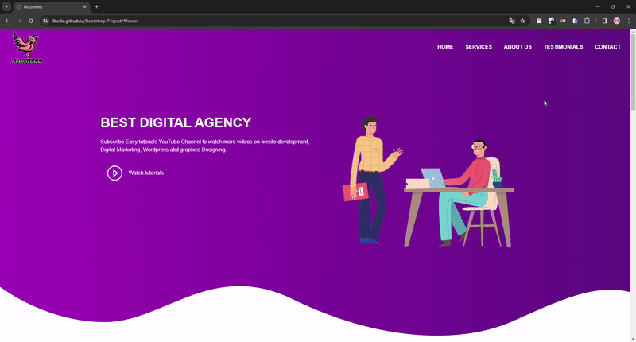

<h1>Flamingo</h1>



[👉click here to login Flamingo](https://ilkerkr.github.io/Bootstrap-Project/)

<h2> Description</h2>

<p>The Flamingo page was mostly made using Bootstrap in order to improve my use of Bootstrap.</p>

<h2>Project Skeleton</h2>

```
Bootstrap-project (folder)
|
|----readme.md                  
|----images  (folder)             
|----index.html  
|----style.css
```